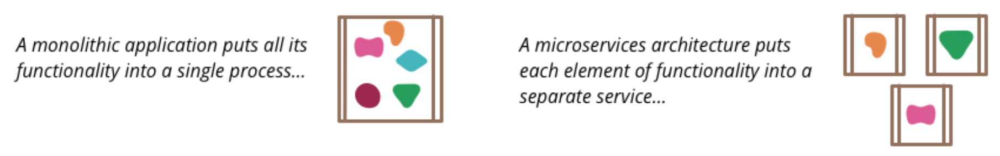
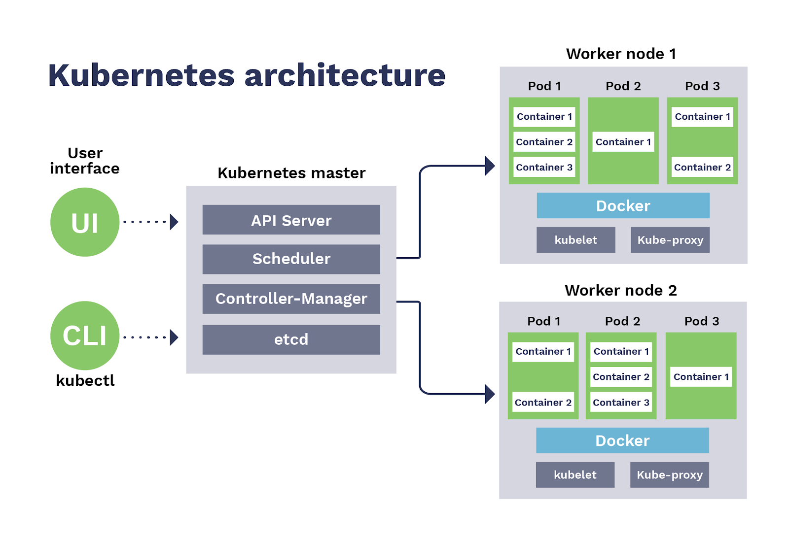
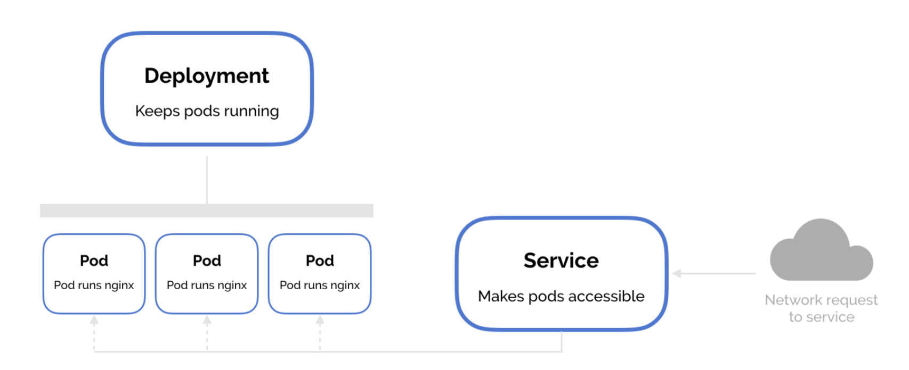
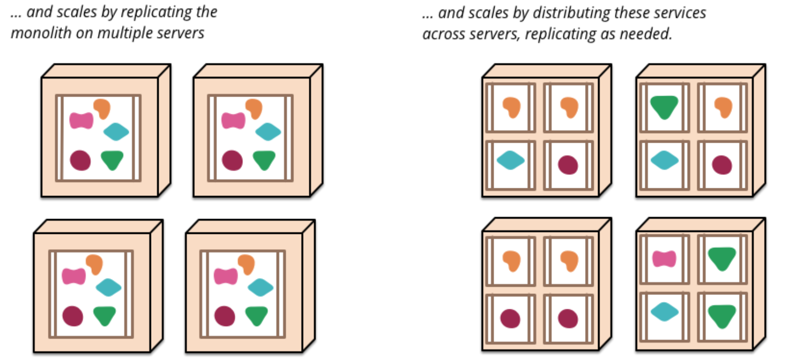

# Microservices Orchestration with Kubernetes

## 1. Introduction

In this session we will experiment with Kubernetes (aka k8s), a container-orchestration system commonly used as a way to host applications developed with a microservices architectural style. Microservices is a broad concept, here we will only focus on the abstractions and tools that Kubernetes provides. 

<p align="center">
  
</p>

The objectives of this assignment are to:

* Obtain a basic understanding of the microservices architectural style.
* Learn the basic functionality of Kubernetes.
* Implement and deploy a simple microservices-based application.

Each group will have to:

1. Tutorial: Follow a brief tutorial about how to deploy a microservice into Kubernetes.  
2. Assignment: Complete the lab assignment consisting on developing and deploying a simple microservices-based application. 
3. Write a .pdf report describing the steps taken to complete the assignment, including screenshots of the application output.

## 2. Kubernetes tutorial

NOTE: This tutorial has been tested in Ubuntu 20.04, macOS 10.13.6 and Windows Home with [WSL2](../wsl.md). It's even possible to do the tutorial inside a virtual machine (e.g. VirtualBox) running Ubuntu, but in that case you should configure the VM with at least 2 cores and 3GB of memory.


### 2.1. Install a toy Kubernetes cluster with Minikube

In a production environment, Kubernetes typically runs over a private computer cluster or it is managed by a cloud provider (e.g. Google GKE, Amazon EKS, etc.). In order to be able to try Kubernetes locally, we will use Minikube, a tool that runs a single-node Kubernetes cluster. 

*NOTE: Minikube is convenient for learning the basics but if you plan to use Kubernetes in your project and you want to deploy it on a server Minikube it's not a convenient option. It's recommended to do it directly with [kubeadm](https://kubernetes.io/docs/setup/production-environment/tools/kubeadm/create-cluster-kubeadm/), or with other tools (MicroK8s, K3s, etc.). An easier alternative is to use a cloud service (e.g. Google GKE, Amazon EKS, etc.).*

#### Prerequisites

It's recommended (and required if you're working over Linux) to have Docker installed on your machine. You can check if it's already installed this way:

    docker -v

If not, you would need to install it. In Ubuntu you can do it this way:

    sudo apt-get update
    wget -qO- https://get.docker.com/ | sh
    sudo usermod -aG docker $(whoami)
    newgrp docker

**WARNING: the newgrp is a trick to avoid the need to log out and log back in order to let the usermod command take effect. However, newgrp runs a new shell and the trick only works within that shell (you won't be able to run docker commands in a different shell).**

Check that Docker is installed and that you can run it without sudo executing:

    docker run hello-world

To install Docker on Windows with WSL2 read [this](../docker_wsl2.md). MacOS installation procedure can be found [here](https://docs.docker.com/install/).

#### Install kubectl 

Kubectl is a command line tool for controlling Kubernetes clusters. You can install it this way:

On Linux:

	curl -LO https://storage.googleapis.com/kubernetes-release/release/$(curl -s https://storage.googleapis.com/kubernetes-release/release/stable.txt)/bin/linux/amd64/kubectl

On MacOS:

	curl -LO https://storage.googleapis.com/kubernetes-release/release/v1.19.0/bin/darwin/amd64/kubectl

On both:

	chmod +x ./kubectl
	sudo mv ./kubectl /usr/local/bin/kubectl

Check the installation:

	kubectl version --client

*NOTE: In case something went wrong you can find more detailed installation instructions for all the platforms [here](https://kubernetes.io/docs/tasks/tools/install-kubectl/).*

#### Install Minikube 

On Linux (also on Windows with WSL2, within the Ubuntu terminal):

	curl -Lo minikube https://storage.googleapis.com/minikube/releases/latest/minikube-linux-amd64

On MacOS:

	curl -Lo minikube https://storage.googleapis.com/minikube/releases/latest/minikube-darwin-amd64

On both:

	chmod +x minikube
	sudo mv minikube /usr/local/bin


### 2.2. Launch a (Minikube) Kubernetes cluster

<!--On Linux (bare-metal execution):

	sudo apt-get install conntrack
	sudo minikube --vm-driver=none start
	sudo mv /root/.kube /root/.minikube $HOME
	sudo chown -R $USER $HOME/.kube $HOME/.minikube
	sudo cp /etc/kubernetes/admin.conf $HOME/
	sudo chown $(id -u):$(id -g) $HOME/admin.conf
	export KUBECONFIG=$HOME/admin.conf
	minikube update-context

	

-->
On Linux or Windows with WSL2 (within the Ubuntu terminal):

	minikube start

On MacOS (using the hypervisor that comes with Docker):

	brew install docker-machine-driver-hyperkit
	sudo chown root:wheel /usr/local/opt/docker-machine-driver-hyperkit/bin/docker-machine-driver-hyperkit
	sudo chmod u+s /usr/local/opt/docker-machine-driver-hyperkit/bin/docker-machine-driver-hyperkit
	minikube start --vm-driver=hyperkit

*NOTE: In case something went wrong you can find more detailed installation instructions for all the platforms [here](https://kubernetes.io/docs/tasks/tools/install-minikube/).*

Minikube runs a single-node Kubernetes cluster (with the help of [Docker Machine](https://github.com/docker/machine)) over a Virtual Machine (or not if you specify the "none" driver). Minikube can interact with different hypervisors specifying a proper driver (list [here](https://minikube.sigs.k8s.io/docs/reference/drivers/)). The minikube "start" command creates and configures the cluster. This command also configures your kubectl installation to communicate with this cluster. 

You can check the status of minikube this way:

	minikube status

We can see the IP address of the Minikube VM with the following command:

	minikube ip

Now that you have a cluster running, you can check if kubectl is able to communicate with it. By default kubectl looks for a configuration file (the "kubeconfig") in the $HOME/.kube directory. The kubeconfig tells kubectls how to communicate with the API server of a cluster. You can view the kubeconfig this way:

	kubectl config view

Let's check the status of the cluster:

	kubectl cluster-info
	
	
#### Troubleshooting

Minikube can be stopped with:

	minikube stop
	
Minikube can be re-started with:

	export KUBECONFIG=$HOME/admin.conf
	minikube --vm-driver=none start

Minikube related files can be deleted with:

	minikube delete --all --purge

WARNING: In case an attempt to run "minikube start" fails, before running it again it's necessary to clean up the local state by running "minikube delete --all --purge".

In case "minikube delete" fails:

	rm -rf ~/.minikube
	

### 2.3. Containerized Hello World microservice

#### Application or microservice?

Generally speaking, microservices are a way of breaking down an application into loosely coupled sub-applications or "services". Here, we will not address how this decomposition should be applied and we will just start from an example application (a typical Hello World web app) that we will call "microservice", assuming that it could be part of a bigger application. 


#### Hello World microservice in Node.js

Kubernetes requires microservices to be containerized. A microservice may consist on serveral containers plus other resources (storage, networking), but here we will use just a single container. Let's start by creating a containerized Hello World microservice. 

In an empty directory called "src", edit a file named "server.js" with the following contents:
```
var http = require('http');

var handleRequest = function(request, response) {
  console.log('Received request for URL: ' + request.url);
  response.writeHead(200);
  response.end('Hello World!');
};
var www = http.createServer(handleRequest);
www.listen(8080);
```

Within the "src" directory edit a file named "Dockerfile" with the following contents:
```
FROM node:6.14.2
EXPOSE 8080
COPY server.js .
CMD node server.js
```
#### Making Docker images accessible to Minikube

In a real scenario you would build your images locally and upload them to Docker Hub or any other registry. In that case, you will have an image's URL to pass to Kubernetes. However, to accelerate things a little bit, here we will skip the usage of a Docker regisry and we will tell Kubernetes to get the images from our local Docker registry.

<!--
On Ubuntu, as we used vm-driver=none, we don't need to do anything, as our single-node Kubernetes cluster it's running directly on the host machine. Your local Docker registry will be directly accessible by the Kubernetes commands.

On **macOS and Windows with WSL2**, Minikube uses it's own built-in Docker daemon. So, if you build your images with your local Docker environment, they will not be directly accessible to Minikube. In order to overcome that problem, we will point our Docker commands directly to the Minikube built-in Docker daemon, building our images there, and making them directly accessible to Minikube. To accomplish that just do the following (only on macOS and Windows with WSL2!):
-->
Because Minikube uses it's own built-in Docker daemon, if you build your images with your local Docker environment, they will not be directly accessible to Minikube. In order to overcome that problem, we will point our Docker commands directly to the Minikube built-in Docker daemon, building our images there, and making them directly accessible to Minikube. To accomplish that just do the following:

	eval $(minikube docker-env)

Now the local Docker environment is pointing to the Minikube’s built-in Docker daemon. 

#### Build the container image 

Now, from within the "src" directory, le'ts build a Docker image this way:

	docker build -f Dockerfile -t helloworld:1.0 .

We are done but if you want you can try your containerized microservice by running the container:

	docker run --name helloworld -d -p 8080:8080 helloworld:1.0

Now check with your browser (localhost:8080) if the microservice is running. 

Finally, stop the container (this is important as later we will need to use port 8080 from Kubernetes):

	docker stop helloworld

### 2.4. A brief introduction to Kubernetes 

Kubernetes is a distributed system for automating (containerized) applications deployment, scaling, and management over a cluster. A Kubernetes cluster consists of a set of worker machines, called worker nodes or just **nodes**. A containerized application (e.g. our Hello World microservice) consists of one or many cotainers and can be executed (replicated) multiple times. Each replica it's called a **Pod** in Kuberentes. Pods run within nodes and nodes can run many Pods (even if they are replicas of the same application). 

<p align="center">
  
</p>

#### Kubernetes and microservices

Kubernetes requires a microservice to be provided as a set of container images plus an optional configuration about storage and networking. Kubernetes does not use the term "microservice" in its API methods and objects, but there are some API objects that implicitly relates to it. On the one hand there's the **Deployment** object, which is basically a configuration that instructs Kubernetes how to create and update instances of a microservice. On the other hand, there's the **Service** object, which defines a logical set of Pods and a policy by which to access them. 

<p align="center">
  
</p>

### 2.4. Deploy your microservice

#### The Deployment object

A Deployment is basically a configuration that instructs Kubernetes how to create and update instances of a microservice. You can specify the Deployment yourself or you can use a default one as we will do next.

Let's deploy our Hello World microservice. Before deploying let's check the status of the cluster:

	kubectl get nodes

The create deployment command creates a new Deployment (a default one). We need to provide the deployment name and microservice image location (usually a repository URL but here we will use the local image name). We want to run the microservice on a specific port so we add the --port parameter:

	kubectl create deployment helloworld --image=helloworld:1.0 --port=8080 --replicas=2

*NOTE: The "port" param is optional and just informational. If you don't specify it you can still access the port inside the cluster. To enable external access you need to create a Service, no matter if you specified the port or not when creating the deployment. But the information may help others to understand the deployment configuration better (the same that happens with EXPOSE in Docker).*

To list your deployments use the get deployments command:

	kubectl get deployments

The READY column should show 2/2 Pods. If it shows 0/2 then something went wrong. You can get more information with:

	kubectl describe deployments/helloworld

If this information is not enough to solve the error you should check the logs of the Pod created for this deployment (see next subsection).

To obtain the related YAML file (you did not used it as you relied on default values):

	kubectl get deployments/helloworld -o=yaml

Note: You can delete a deployment with "kubectl delete deployment NAME"


#### Pods

A Pod is a single instantiation of your microservice. You can execute multiple Pods (replicas) to scale a microservice. 

When we deployed our microservice before, Kubernetes executed one Pod. You can see all the running pods with:

	kubectl get pods

It will be convenient to save the name of one of the pods (POD_NAME) that instantiates our microservice within an environment variable. For instance (replace the POD_NAME for the name of one of your pods):

	export MYPOD=helloworld-674c4d4dc8-6qn5r

Check that the variable has the correct value this way:

	echo $MYPOD

You can obtain information about the Pod with 
	
	kubectl describe pod $MYPOD

To see the logs relatd to the Pod:

	kubectl logs pods/$MYPOD

If there would be more than one container in the Pod, you should use this:

	kubectl logs pods/$MYPOD helloworld

Kubernetes creates an endpoint for each pod, based and the pod name. However, these endpoints are not directly visible from outside (the Kubernetes cluster is running on a private network). The kubectl command can create a proxy that will forward communications to the local port 8001 into the private network: 

	kubectl proxy &

Press return and type:

	curl http://localhost:8001/api/v1/namespaces/default/pods/$MYPOD/proxy/

Kill the proxy this way:

	pkill kubectl

#### Working without a deployment, the run command

The helloworld deployment that we created is just a "configuration" where we describe a desired state. But, can an application be launched without a deployment object? The answer is yes, if you don't need to specify complex deployment options. It can be done with the "kubectl run" command. Let's execute the following, which will be familiar for Docker users:

	kubectl run helloworld2 --port=8080 --image-pull-policy=Never --image=helloworld:1.0 

Check that the helloworld2 application has been instantiated with a Pod:

	kubectl get pods

However, we will not use this "run" command, we will work with deployments. Let's delete the pod (it may take some seconds):

	kubectl delete pod helloworld2 --grace-period=0

<!--
Let's delete it this way:

	kubectl delete deployment helloworld

The deployment has been deleted (you can check that with "kubectl get deployments") but the pods that were launched to satisfy the (deleted) deployment are still running. Check it with:

	kubectl get pods

Let's delete one of the pods "kubectl delete pod POD_NAME". The other pods will be automatically deleted. 

So, if the application can run without a deployment object, can it be also launched without a deployment object? The answer is yes, if you don't need to specify complex deployment options. It can be done with the "kubectl run" command. Let's execute the following, which will be familiar for Docker users:

-->


#### Services

The execution of a microservice is done by one or more replicated Pods, that are dynamically created and destroyed. To isolate the microservice clients from this complexity in Kubernetes you define a Service configuration. Services allow your microservices to receive traffic. There are different types of Services, the default type is ClusterIP, that just exposes the Service on an internal IP in the cluster (not visible from outside). 

Try the following:

	kubectl get services

You will see a service called "kubernetes" that is created by default when minikube starts the cluster.

Let's create a new Service for our Hello World microservice:

	kubectl expose deployment/helloworld --type="NodePort" --port 8080

The NodePort Service type is accessible from outside the cluster. Let's get information about the new service:

	kubectl describe service helloworld

Write down the port number of the NodePort field (NODE_PORT). 

Now you can already call your microservice this way:

	curl $(minikube ip):NODE_PORT

You should see the "Hello World!" message.

NOTE: On **Windows with WSL2** you need and extra step to acess the service. Run the following command to map a port from localhost to the port of the service. In the Ubuntu terminal run:

	kubectl port-forward service/helloworld 7080:8080

And try accessing localhost:7080 in your browser.

### 2.5. Scale your microservice

If traffic increases, we will need more instances/replicas of the microservice (Pods) to keep up with user demand. The possibility to scale parts of an application independently is one of the advantages of microservices. The following figure, from a [James Lewis' article](https://martinfowler.com/articles/microservices.html), illustrates the idea:

<p align="center">
  
</p>

Let's start by checking the current number of Pods:

	kubectl get deployments

The READY column shows the ratio of CURRENT to DESIRED replicas (Pods). We should have 2/2 Pods. 

Next, let’s scale the Deployment to 4 replicas:

	kubectl scale deployments/helloworld --replicas=4

Type again:

	kubectl get deployments

Now we have 4 instances of the microservice available. Next, let's check if the number of Pods changed:

	kubectl get pods -o wide


### 2.6. What about data?

The management of data in a microservices-based architecture is a very complex and controversial topic. Ideally, microservices should be independent also in terms of data, as illustrated by the following figure from the [James Lewis' article](https://martinfowler.com/articles/microservices.html):

<p align="center">
  
</p>

However, this may be difficult to accomplish in reality as usually companies store their data into dedicated systems or cloud services. But let's skip these issues here and just mention some options that Kubernetes offers regarding data storage. Regarding persistent data that can be directly stored in the filesystem (i.e. files), we cannot directly store them within a Pod's container as Pods are ephimeral. Kubernetes provides tools to deal with that such as PersistentVolumes. It's relativelly easy to use a PersistentVolume if we don't need it to scale along with our Pods (static). Otherwise, the thing becomes more complex and we will need to deal with Kubernetes' StatefulSets. Here, we are not going to experiment with none of those situations. Regarding structured data that we typically store within a database, some popular DBMS such as MongoDB provide help for running them, in a scalable way, within Kubernetes. But doing this can be quite complex, and we will not address that option either. 

The microservice in this tutorial is stateless, so we don't have to deal with data. However, [here](mongodb.md) we have extended the tutorial to make it use a MongoDB database running in a second container within the same Pod. It's not a real solution, but can be a simple shortcut in case you plan to use Kubernetes in your project. This is not part of this lab session.     

## 3. Lab assignment 

### 3.1. Creating and deploying your own microservices-based car rental Web API

#### Description

As an example microservices-based application you will create and deploy a simple car rental web API. It will consist in the same functionalities that were described in the lab session about web APIs:

- Request a new rental: An endpoint to register a new rental order. Input fields will include the car maker, car model, number of days and number of units. The total price of the rental will be returned to the user along with the data of the requested rental.
 
- Request the list of all rentals: An endpoint that will return the list of all saved rental orders (in JSON format). 

Regarding the DATA, you can directly store it within a JSON file into the disk, as if you were working locally. These data can be lost anytime, as the Pods are ephimeral, but it will be ok for this lab session. If you are interested in knowing how to do that better, you can use a Kubernete's PersistentVolume as explained [here](persistentvolume.md)

*NOTE: It's not necessary to partition the car renal Web API into two microservices, the code from the previous lab session will be ok.*

*NOTE: When building and deploying your microservice use a complete docker image name+tag, with version number, such as in helloworld:1.0.*

<!-- TODO: Make an optional part consisting in partitioning the microservice and using a persistent volume-->

## 4.  Submission

You need to upload the following files to your BSCW's lab group folder before the next lab session (it's not necessary to upload any code as it's the same from the previous lab session):

<!--* A tarball containing the source files.-->
* A .pdf with a report describing the steps taken to complete the assignment, including screenshots of the application output.   

## 4. Further reading

* [James Lewis' article about Microservices](https://martinfowler.com/articles/microservices.html).
