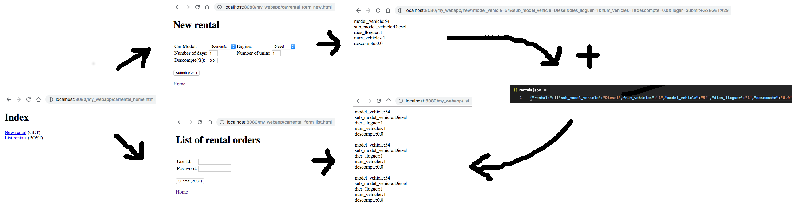

# Java Servlets

## Introduction

In this session we will learn to develop a web application with Java servlets, a convenient mechanism of programming the back end of a web application (or any other kind of client-server distributed application) in Java without the programmer having to deal with the HTTP protocol (or any other protocol) directly. 

The objectives of this assignment are to:

* Understand the context for servlets by setting up Tomcat, a simple servlet-capable web server.
* Understand what a servlet is.
* Learn the basic servlet APIs.
* Implement a simple servlet-based web application.

Each group will have to:

1. Tutorial: Follow a brief tutorial about how to develop the back end (server side) of a web applications with servlets and Tomcat 10.  
2. Assignment (basic part): Complete the lab assignment consisting on developing a simple car rental web application. 
3. Extensions: Optionally complete one of the suggested extensions.
4. Write a .pdf report describing the steps taken to complete the assignment, including screenshots of the application output.

## 0. Download pti repository

You may first download the pti repository from gitlab if this is convenient for you.

    git clone https://repo.fib.upc.es/felix.freitag/pti

## 1. Java Servlets with Tomcat 10, a quick tutorial

[(help for those wanting to use their own computers (through Docker))](./../docker.md)

### 1.1 Booting the machine

Select the latest Ubuntu imatge and type your username and password:

    user: alumne
    pwd: sistemes

### 1.2 Install Tomcat 10

Open a terminal (CTRL+ALT+T).

Let's start by updating the Ubuntu's Package Index:

    sudo apt-get update

Check if a Java SDK is installed:

    javac -version

If not installed do the following to install OpenJDK:

    sudo apt-get install default-jdk

Install Tomcat 10 (open the zip in the servlet folder):

    tar -xvzf apache-tomcat-10.0.10.tar.gz

Enter the Tomcat 10 directory (we will work from here from now on):

    cd apache-tomcat-10.0.10

Launch Tomcat 10:

    ./bin/startup.sh &

Check if it's running (with the browser): http://localhost:8080/ 

### 1.3 Create and display a simple HTML page

Being in the folder apache-tomcat-10.0.10:

    mkdir webapps/my_webapp
    nano webapps/my_webapp/index.html

        <html>
            <h1>Hello World!</h1>
        </html>

Check: http://localhost:8080/my_webapp

### 1.4 Create and simple servlet

    mkdir webapps/my_webapp/WEB-INF
    nano webapps/my_webapp/WEB-INF/web.xml

        <web-app>
            <servlet>
              <servlet-name>my_servlet</servlet-name>
              <servlet-class>mypackage.MyServlet</servlet-class>
            </servlet>
            <servlet-mapping>
              <servlet-name>my_servlet</servlet-name>
              <url-pattern>/my_servlet</url-pattern>
            </servlet-mapping>
        </web-app>
    
    mkdir webapps/my_webapp/WEB-INF/classes
    mkdir webapps/my_webapp/WEB-INF/classes/mypackage
    nano webapps/my_webapp/WEB-INF/classes/mypackage/MyServlet.java

        package mypackage;
        import java.io.*;
        import jakarta.servlet.*;
        import jakarta.servlet.http.*;
        public class MyServlet extends HttpServlet {
          public void doGet(HttpServletRequest req, HttpServletResponse res)
                            throws ServletException, IOException {
            res.setContentType("text/html");
            PrintWriter out = res.getWriter();
            out.println("<html><big>I'm a servlet!!</big></html>");
          }
        }

    javac -cp lib/servlet-api.jar webapps/my_webapp/WEB-INF/classes/mypackage/*.java

After changing the .class files, it may be necessary to restart Tomcat. You can do it this way:

    ./bin/shutdown.sh
    ./bin/startup.sh &

Check browser:

        http://localhost:8080/my_webapp/my_servlet

Check errors or the things you write to stdout: 
        
        tail -n 200 logs/catalina.out
        tail -n 200 logs/localhost.20XX-XX-XX.log

It's useful to open a dedicated terminal and check errors continuously:

        tail -f 200 logs/catalina.out

In order to avoid restarting Tomcat every time you recompile your servlets it's VERY USEFUL editing the conf/context.xml file this way (and restarting Tomcat):

	...
	<Context reloadable="true">
	...

## 2 Lab assignment 

### 2.1 Creating your own car rental web page 

#### 2.1.1 Description

You have to program a simple **car rental web application** using Tomcat and servlets. It will consist in two functionalities:

- Request a new rental: A form to enter a new rental order. Input fields will include the car model, engine, number of days, number of units and discount. If all data is correct, the **data of the requested rental will be returned**.

- Request the list of all rentals: A form asking a password (as only the administrator can see this information) that will **return the list of all saved rental orders**. 

<!------> 

Both functionalities will consist in a request form plus a response page. In our lab exercise the request forms are static HTML pages and the responses are HTML dynamically generated from the servlets. For simplicity, in case of invalid input it is not needed to show the request form again (though you can do it if you want).

In order to keep the rentals data (to be able to list them) you will need to save the data to the disk. A single text file where each line represents a rental will be enough (though not in a real scenario). **We will use JSON format** for writing/reading rental orders to disk (see above the figure). We have included json-simple-1.1.1.jar, which may help you to perform this task (http://www.mkyong.com/java/json-simple-example-read-and-write-json/).

#### 2.1.2 Install the provided sources

In order to help you, some files are provided:

- An HTML index file: carrental_home.html
- A rental request HTML form: carrental_form_new.html (it calls CarRentalNew.java)
- A rentals list request HTML form: carrental_form_list.html (it calls CarRentalList.java)
- Two servlets (partially programmed): CarRentalNew.java and CarRentalList.java.
- A JSON library: json-simple-1.1.1.jar.

<!--- NOTE: It's not compulsory to use these files within the solution (you may, for instance, prefer to generate the forms dynamically from the servlets).---> 

In order to install the provided files perform the following steps:

Download and unzip the file or take it from your local servlet folder:

    wget https://repo.fib.upc.edu/pti/pti/raw/master/servlets/carrental.zip

Move the files to Tomcat and compile the servlets:
    
    mv *.html webapps/my_webapp/
    mv *.java webapps/my_webapp/WEB-INF/classes/mypackage
    mkdir webapps/my_webapp/WEB-INF/lib
    mv json-simple-1.1.1.jar webapps/my_webapp/WEB-INF/lib        
    javac -cp lib/servlet-api.jar:webapps/my_webapp/WEB-INF/lib/json-simple-1.1.1.jar webapps/my_webapp/WEB-INF/classes/mypackage/*.java

Add two new servlet definitions to web.xml:

        nano webapps/my_webapp/WEB-INF/web.xml

        <web-app>
            <servlet>
              <servlet-name>new</servlet-name>
              <servlet-class>mypackage.CarRentalNew</servlet-class>
            </servlet>
            <servlet-mapping>
              <servlet-name>new</servlet-name>
              <url-pattern>/new</url-pattern>
            </servlet-mapping>
            <servlet>
              <servlet-name>list</servlet-name>
              <servlet-class>mypackage.CarRentalList</servlet-class>
            </servlet>
            <servlet-mapping>
              <servlet-name>list</servlet-name>
              <url-pattern>/list</url-pattern>
            </servlet-mapping>
        </web-app>

Check the following link and its sublinks:
	
	http://localhost:8080/my_webapp/carrental_home.html

The form 

    http://localhost:8080/my_webapp/carrental_form_new.html

calls a servlet with name "new" that corresponds to the class mypackage.CarRentalNew.

The form

    http://localhost:8080/my_webapp/carrental_form_list.html

calls a servlet with name "list" that corresponds to the class mypackage.CarRentalList. 
You can see that in the response of the servlet appears the text that you have written in the field "UserId" of the form. This is because the servlet obtains with the line 

    String nombre = req.getParameter("userid");     

the value which is put in the html form.

Now add the necessary code to the source file of these two servlets, i.e., CarRentalNew.java and CarRentalList.java, to make the application work properly.

### 2.2 SSL/TLS configuration 

Create a keystore file (JKS format, Java KeyStore standard) to store the server's private key and self-signed certificate by executing the following command:
 
    keytool -genkey -alias tomcat -keyalg RSA #specify a password value of "changeit".

Next, you will be prompted for the keystore password. Specify "changeit". Next, you will be prompted for general information about this Certificate, such as company, contact name, and so on. You can type the RETURN key (UNKNOWN) for all the fields but be sure to answer "yes" to the last question. Finally, you will be prompted for the key password, which is the password specifically for this Certificate. Type the ENTER key to automatically use the same password that you specified for the keystore. The command will create a new file, in the home directory of the user under which you run it, named ".keystore". This file is a Java KeyStore with the Java's JKS standard. 

Now add the following entry in conf/server.xml:

    nano conf/server.xml

    <Connector protocol="org.apache.coyote.http11.Http11NioProtocol"
        sslImplementationName="org.apache.tomcat.util.net.jsse.JSSEImplementation"
        port="8443"
        maxThreads="150"
        SSLEnabled="true">
        <SSLHostConfig>
            <Certificate
            certificateKeystoreFile="${user.home}/.keystore"
            type="RSA"
          />
        </SSLHostConfig>
    </Connector>

Restart Tomcat:

    ./bin/shutdown.sh
    ./bin/startup.sh &

Check your browser:
    
    https://localhost:8443
    
    

If you get the "connection is not private" warning then your SSL/TLS configuration is ready. Otherwise check for errors:

     tail -n 200 logs/catalina.out

You can find more information about the Tomcat's SSL/TLS configuration [here](https://tomcat.apache.org/tomcat-9.0-doc/ssl-howto.html).

### 2.3 Dockerization 

Dockerize your web application. Some help [here](./dockerize.md).

### 2.4 Optional extensions
<!-- In order to obtain the maximum grade you can complete any of the following extensions: -->
* Add to the report a 1-page explanation of the pros and cons of using Java servlets compared to another alternative (e.g. Node.js). 
* Create a docker-compose.yml file to run the container of your Tomcat image with docker-compose (instead through docker run).
* Save the data within a database (e.g. MySQL) instead of a file. Some help [here](./mysql.md).

## 3.  Submission

You need to upload the following files to your GDrive's lab group folder before the next lab session:

* A tarball containing the source files.
* A .pdf with a report describing the steps taken to complete the assignment, including screenshots of the application output.   

## 4. Further reading

* [Java Servlet Technology section](https://javaee.github.io/tutorial/servlets.html) of the "Java Platform, Enterprise Edition (Java EE) 8. The Java EE Tutorial".

## ANNEX 1. Help with the JSON file

One possible way of saving the rentals within a JSON file would be the following (in pseudo-code):

	JSONObject root = null;
	If file "/home/alumne/apache-tomcat-9.0.5/rentals.json" exists: 
		Parse file into root object.
	
	Else: 
		Create new JSON object into root object. 
		Create new (empty) JSONArray object.
		Put the JSONArray object into the root object.
	
	Create a new JSON object for the new rental with the value of the received params.
	Get the array object from the root.
	Add the new rental JSON object to the array object.
	
	Write the root JSON object to the file. 
		

